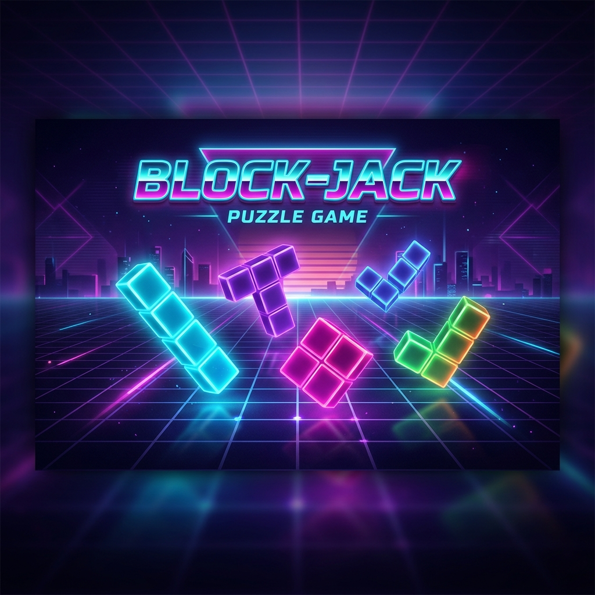
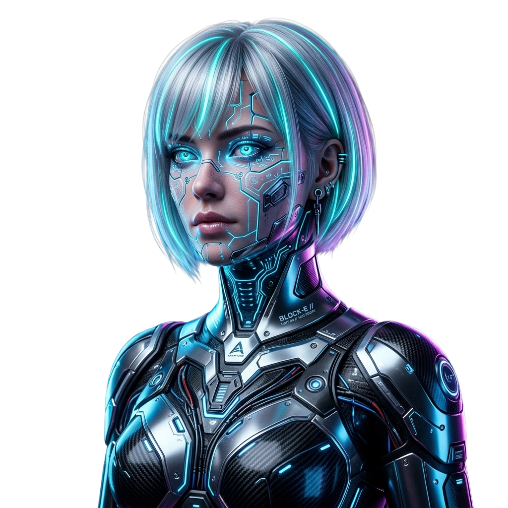
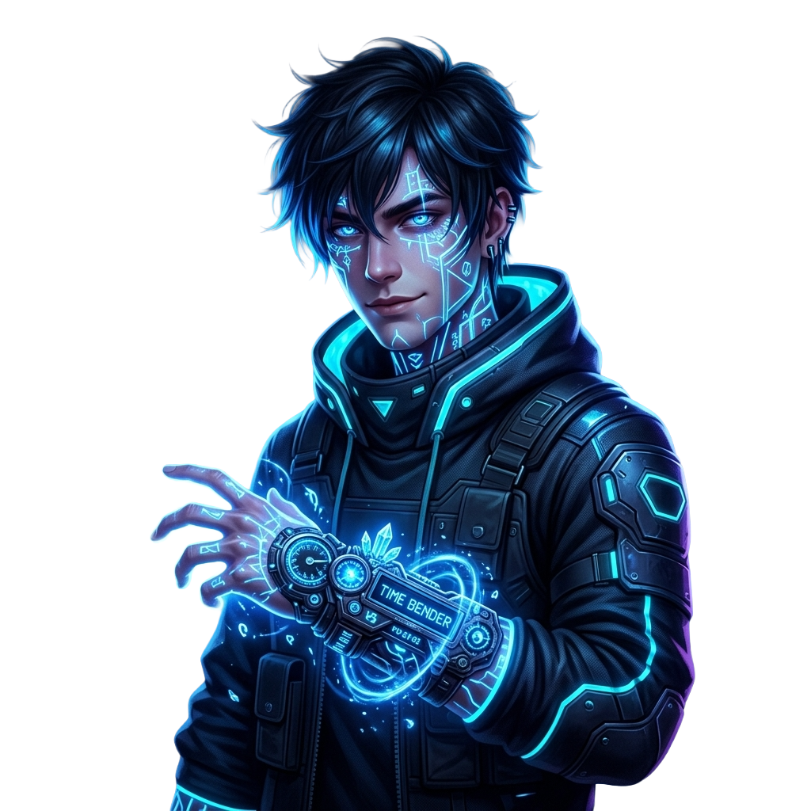
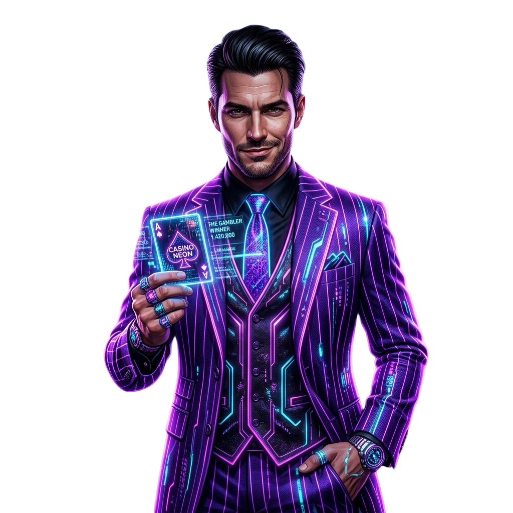
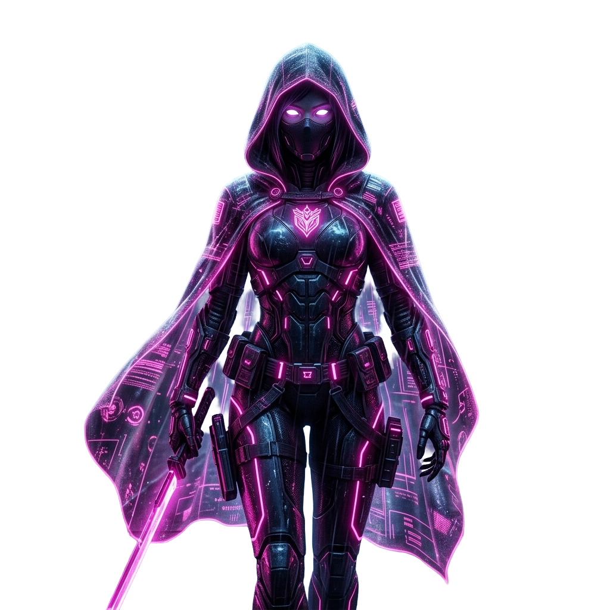

# 🕹️ BLOCK-JACK — Roguelite Puzzle Strategy



**Block-Jack**, "Block Blast" tarzı klasik bulmaca mekaniklerini, **Balatro** ve **Hades**'ten esinlenen derin roguelite stratejileriyle birleştiren, iOS platformu için geliştirilmiş premium bir mobil oyundur.

---

## 🚀 Oyunun Ruhu

Neon ışıklı bir dünyada, sadece blok yerleştirmekle kalmazsınız; her hamleniz hem anlık skorunuzu hem de uzun vadeli hayatta kalma stratejinizi belirler. Synthwave ritimleri eşliğinde joker sinerjileri ve renk yönetimini kullanarak en yüksek "Flush" çarpanlarını hedefleyin!

---

## ✨ Ana Özellikler

### 🧩 1. Derin Bulmaca Mekanikleri
*8×8 dinamik grid* üzerinde Tetris şekillerini yerleştirin. Satır veya sütunları temizleyerek puan kazanın. Ancak dikkat! Sadece patlatmak yetmez; aynı renkleri bir araya getirerek devasa çarpanlar kazandıran **Flush!** sistemini kullanmalısınız.

### 🃏 2. Roguelite Sinerjiler (Balatro Ruhu)
*   **Joker Sistemi:** Run sırasında satıcıdan alacağınız kalıcı pasif güçlendirmelerle (Blue Pill, Golden Stamp vb.) oyunun kurallarını kendi lehine çevir.
*   **Aktif Itemlar:** Balyoz, Boya Bombası veya Vakum gibi tek kullanımlık eşyalarla sıkıştığın anlarda sahadan kurtul.

### 👥 Karakter Roster'ı ve Yetenekler

Block-Jack'te her karakter, oyun tarzınızı tamamen değiştiren benzersiz bir **Pasif** ve **Overdrive (Aktif)** yeteneğe sahiptir. Karakterler, run sırasında kazandığınız elmaslarla açılır.

| Karakter | Portre | Özellikler & Güçler | Kilit |
| :--- | :---: | :--- | :---: |
| **BLOCK-E** |  | **Pasif (Eraser):** Her 10 saniyede bir sahadaki rastgele bir bloğu siler.<br>**Overdrive:** 5 saniye boyunca tüm kombo çarpanlarını ×5 yapar. | **Başlangıç** |
| **THE ARCHITECT** |  | **Pasif:** Kare (O) bloklara +%20 puan bonusu verir.<br>**Overdrive:** Sahadaki 3x3'lük bir alanı anında temizler. | **500 💎** |
| **TIME BENDER** |  | **Pasif:** Kombo süresi %50 daha yavaş düşer.<br>**Overdrive:** Zamanı ve çarpanı 3 hamle boyunca dondurur. | **800 💎** |
| **THE GAMBLER** |  | **Pasif:** %7 ihtimalle yapılan hamlenin puanı ×10 olur.<br>**Overdrive:** Elindeki ve sahadaki 3 bloğu rastgele yeniler. | **1200 💎** |
| **NEON WRAITH** |  | **Pasif:** Süre <%10 kaldığında tüm puanlar ×3 olur.<br>**Overdrive:** Dolu karelerin üzerine blok koyabilir ve alttakileri siler. | **3000 💎** |

---

## ⚡ Gelişmiş Oyun Mekanikleri

### 🧬 Çarpan (Mult) Sistemi
Sadece satır silmek yetmez! **Balatro** tarzı çarpan sistemimizle skorunuzu katlayın:
- **Flush!:** Satırın %100'ü aynı renk ise **×5 mult**.
- **Double Flush:** İki satır aynı anda %100 renk ise **×25 mult!**
- **Streak:** Üst üste başarılı hamleler çarpanı **+3.0** değerine kadar artırır.

### 🃏 Jokerler & İtemler
Marketten alacağınız 3 farklı slotla stratejinizi kurun:
- **Blue Pill 💊:** Mavi bloklar ×2 Chips verir.
- **Prism 🔷:** Flush yapınca ekstra +0.5 Mult eklenir.
- **Vakum 🌀:** Tablodaki tüm 1x1 boşlukları tek seferde siler.

### 👾 Boss Karşılaşmaları (Her 5. Round)
- **Glitch:** Rastgele kareleri kilitler, blok konulamaz.
- **Fog:** Süre barını gizleyerek sizi karanlıkta bırakır.
- **Weight:** Bloklar "ağır" olur, patlaması için 2 kez temizlenmesi gerekir.

---

## 🛠️ Kurulum ve Çalıştırma

> [!IMPORTANT]
> **Özel Proje Notu:** Bu proje kişisel gelişim ve portfolyo amacıyla geliştirilmiştir. Tüm hakları saklıdır, izinsiz kopyalanması veya ticari amaçla kullanılması yasaktır.

1. Repoyu klonlayın:
   ```bash
   git clone git@github.com:YakupSd/BlockJack.git
   ```
2. `Block-Jack.xcodeproj` dosyasını Xcode ile açın.
3. iOS 17.0+ hedefleyen bir simülatör veya gerçek cihaz seçin.
4. `Cmd + R` ile projeyi derleyin ve çalıştırın.

---

## 🛡️ Lisans ve Kullanım

Bu proje **Yakup Suda**'ya özel bir projedir. Kodların kopyalanması, dağıtılması veya üzerinde değişiklik yapılması kesinlikle yasaktır. Proje sadece inceleme amaçlı yayındadır.

---

## 🎨 Tasarım Estetiği (Synthwave Palette)

| Renk | Hex | Kullanım |
|---|---|---|
| Cosmic Black | `#0A0A0F` | Arka plan |
| Neon Cyan | `#00F5FF` | Vurgu, aktif elemanlar |
| Neon Purple | `#BF5FFF` | Çarpan göstergesi |
| Neon Pink | `#FF2D78` | Can barı, tehlike |

---

### 👨‍💻 Geliştirici
**Yakup Suda** - Roguelite Puzzle enthusiast.
