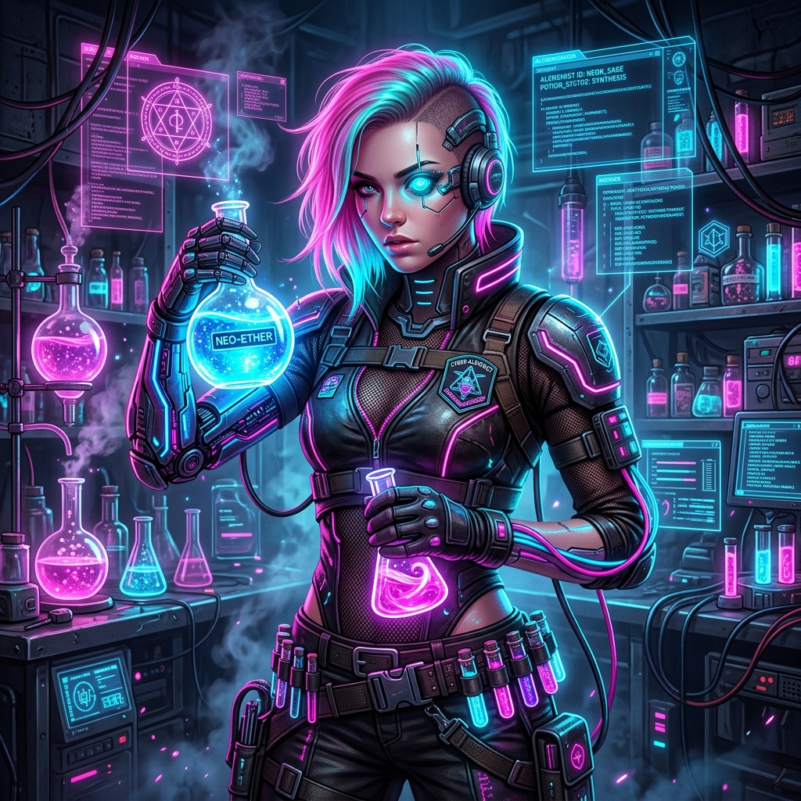
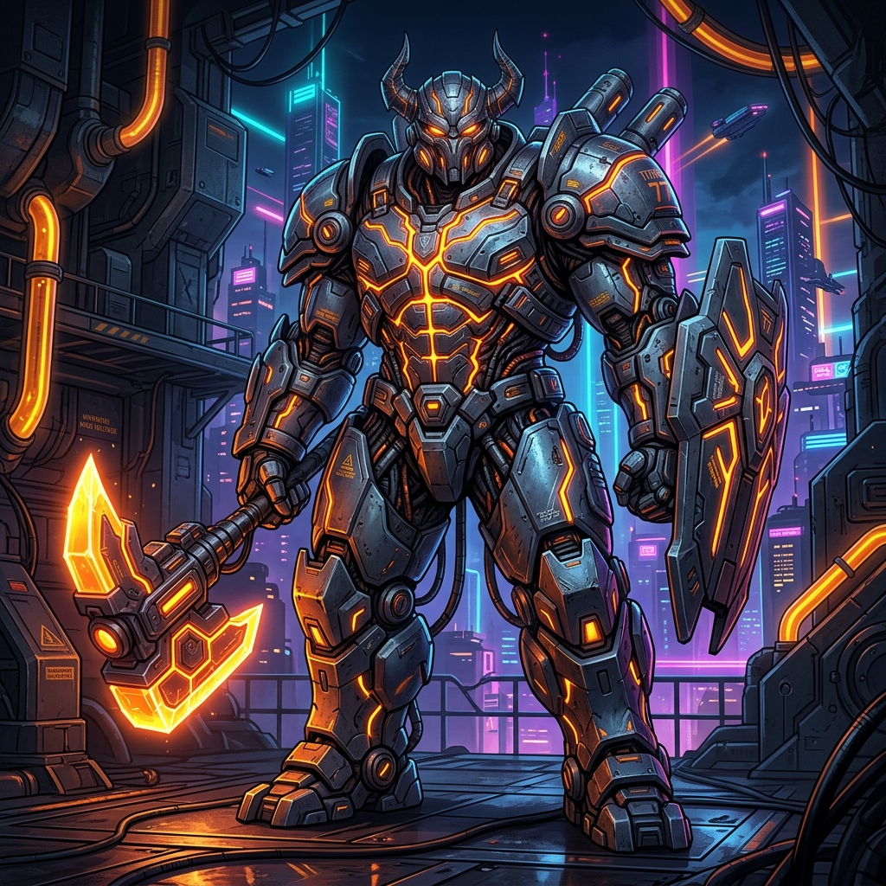

# 🕹️ BLOCK-JACK — Roguelite Puzzle Strategy

**Block-Jack**, "Block Blast" tarzı klasik bulmaca mekaniklerini, **Balatro** ve **Hades**'ten esinlenen derin roguelite stratejileriyle birleştiren, iOS platformu için geliştirilmiş premium bir mobil oyundur.

---

## 🚀 Oyunun Ruhu

Neon ışıklı siber-uzayda, sadece blok yerleştirmekle kalmazsınız; her hamleniz hem anlık skorunuzu hem de uzun vadeli hayatta kalma stratejinizi belirler. Synthwave ritimleri eşliğinde joker sinerjileri ve renk yönetimini kullanarak en yüksek "Flush" çarpanlarını hedefleyin!

---

## ✨ Ana Özellikler

### 🗺️ 1. Dinamik World Map (Hades Tarzı)
Yeni eklenen **World Map** sistemi ile her run benzersizdir. Şehir bölgelerinde ilerlerken yolunuzu kendiniz seçin:
- **Battle Nodes:** Standart veri temizleme görevleri.
- **Elite Nodes:** Daha zor düşmanlar, daha yüksek ödüller.
- **Rest Site:** Can yenileme veya yetenek yükseltme istasyonları.
- **Merchant:** Joker ve Item satın alabileceğiniz marketler.
- **Treasure Room:** Ücretsiz güçlü itemlar.
- **Mystery Node:** Şansınıza bağlı olarak iyi veya kötü sürprizler.

### 👾 2. Düşman Atak Sistemi
Düşmanlar artık pasif değil! Her 20-40 saniyede bir gelen saldırılara karşı tetikte olun:
- **SABOTAJ:** Grid'den rastgele 5 bloğu siler.
- **KİLİTLEME:** Tepsideki blokları 12 saniye boyunca kilitler.
- **ZAMAN HIRSIZI:** Süre barından 20 saniye çalar!
- **LANET YAYICISI:** Temas halinde süre azaltan lanetli hücreler bırakır.
- **AĞIR ZIRH:** Patlaması için 2 kez temizlenmesi gereken ağır engeller.

### 🧩 3. Derin Bulmaca Mekanikleri
*8×8 dinamik grid* üzerinde Tetris şekillerini yerleştirin. Satır veya sütunları temizleyerek puan kazanın. **Flush!** sistemini (aynı renk temizliği) kullanarak devasa çarpanlar kazanın.

---

## 👥 Karakter Roster'ı ve Overdrive Tiers

Block-Jack'te her karakterin 3 farklı **Overdrive Tier**'ı bulunur. Enerjinizi ne kadar çok doldurursanız, o kadar güçlü bir yetenek tetiklersiniz.

| Karakter | Portre | Özellikler & Overdrive Tiers | Kilit |
| :--- | :---: | :--- | :---: |
| **BLOCK-E** |  | **Pasif:** Her 10s bir blok siler. **T1:** Hedefli Satır Sil. **T2:** Çapraz Temizlik (Satır+Sütun). **T3:** 3x3 Alan Bombası. | **Başlangıç** |
| **THE ARCHITECT** |  | **Pasif:** Kare bloklara +%20 puan. **T1:** 3x3 Yıkım. **T2:** 5x5 Alan Temizliği. **T3:** 7x7 Mega Yıkım +1500 Puan. | **500 💎** |
| **TIME BENDER** |  | **Pasif:** Kombo süresi %50 yavaş düşer. **T1:** 5sn Zaman Durdurma. **T2:** 8sn Durdurma + Tepsi Yenileme. **T3:** 3 Hamle Boyunca Zamanı Dondur. | **800 💎** |
| **THE GAMBLER** |  | **Pasif:** %7 ihtimalle ×10 puan. **T1:** 1 Bloğu Yenile. **T2:** Tüm Tepsiyi Yenile. **T3:** Jackpot! +2000 Puan + Yeni Tepsi. | **1200 💎** |
| **NEON WRAITH** |  | **Pasif:** Düşük sürede ×3 puan. **T1:** +15sn Zaman. **T2:** +25sn + En Dolu Satırı Sil. **T3:** Wraith Fury: Sonraki 3 Temizlik +2 Mult. | **3000 💎** |
| **ALCHEMIST** |  | **Pasif:** Renk değişimlerinde +50 puan. **T1:** Tepsiyi Yenile. **T2:** Flush Ready (Tüm tepsi tek renk). **T3:** Double Count: 3 Hamle Boyunca ×2 Skor. | **2000 💎** |
| **TITAN** |  | **Pasif:** Blok patladığında komşu hücrelere hasar. **T1:** Dev 3x3 Blok. **T2:** Çift Dev Blok +500 Overkill. **T3:** Earthquake: Tüm Grid'i Sıfırla +2500 Puan. | **4000 💎** |

---

## 👾 Boss Karşılaşmaları

Her sektörün sonunda sizi bekleyen devasa veri koruma protokolleri:

| Boss Name | Sector | Special Modifier |
| :--- | :---: | :--- |
| **VIPER X** | 1 - 3 | **VERİ SİSİ:** Görüş alanını daraltır. |
| **SENTINEL K** | 4 - 7 | **GLITCH:** Grid hücrelerini rastgele kilitler. |
| **GHOST MOTHER** | 8 - 11 | **PHANTOM:** Hayalet bloklarla gridi doldurur. |
| **JUGGERNAUT** | 12 - 17 | **AĞIRLIK:** Blokları ağırlaştırır, temizlemek zorlaşır. |
| **NEON OVERLORD** | 18+ | **PROTOKOL SIFIR:** Tüm modifikatörlerin kaotik karışımı. |

---

## 🧬 Gelişmiş Mekanikler

### 🌈 Flush & Mult Sistemi
- **Flush!:** Satırın %100'ü aynı renk ise **×5 mult**.
- **Double Flush:** İki satır aynı anda %100 renk ise **×25 mult!**
- **Sinerjiler:** Satın aldığınız Jokerler (Blue Pill, Prism vb.) bu çarpanları katlayarak milyonluk skorlara ulaşmanızı sağlar.

### 💥 Görsel Şölen (VFX)
Yeni eklenen **Canvas-based Particle System** ile her patlama, her temizlik ve her overdrive kullanımı yüksek FPS ve akıcı animasyonlarla desteklenmiştir.

---

## 🛡️ Lisans ve Kullanım

Bu proje **Yakup Suda**'ya özel bir projedir. Kodların kopyalanması, dağıtılması veya üzerinde değişiklik yapılması kesinlikle yasaktır. Proje sadece inceleme amaçlı yayındadır.

---

## 🎨 Tasarım Estetiği (Synthwave Palette)

| Renk | Hex | Kullanım |
|---|---|---|
| Cosmic Black | `#0A0A0F` | Arka plan |
| Neon Cyan | `#00F5FF` | Vurgu, aktif elemanlar |
| Neon Purple | `#BF5FFF` | Çarpan göstergesi |
| Neon Pink | `#FF2D78` | Can barı, tehlike |

---

### 👨‍💻 Geliştirici
**Yakup Suda** - Roguelite Puzzle enthusiast.
