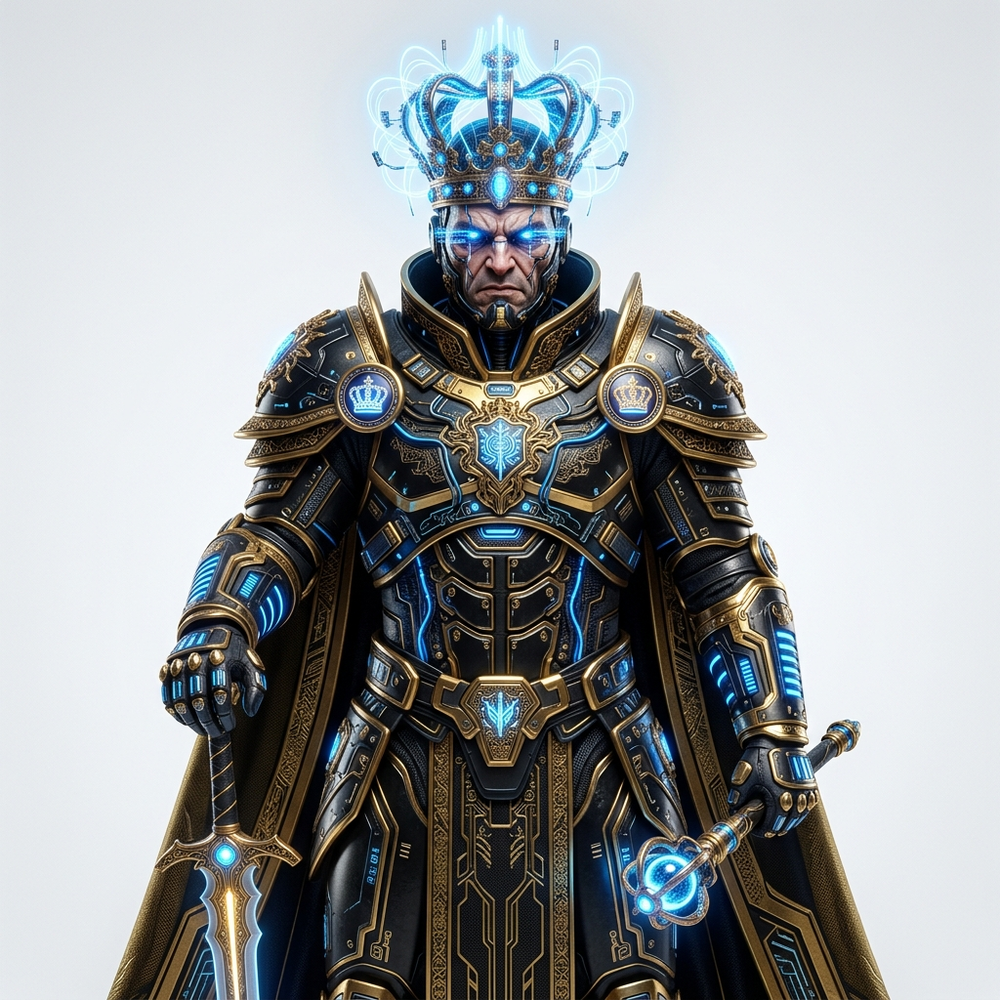

# 🕹️ BLOCK-JACK — Roguelite Puzzle Strategy


**Block-Jack**, "Block Blast" tarzı klasik bulmaca mekaniklerini, **Balatro** ve **Hades**'ten esinlenen derin roguelite stratejileriyle birleştiren, iOS platformu için geliştirilmiş premium bir mobil oyundur.

---

## 🚀 Oyunun Ruhu

Neon ışıklı bir dünyada, sadece blok yerleştirmekle kalmazsınız; her hamleniz hem anlık skorunuzu hem de uzun vadeli hayatta kalma stratejinizi belirler. Synthwave ritimleri eşliğinde joker sinerjileri ve renk yönetimini kullanarak en yüksek "Flush" çarpanlarını hedefleyin!

---

## ✨ Ana Özellikler

### 🧩 1. Derin Bulmaca Mekanikleri
*8×8 dinamik grid* üzerinde Tetris şekillerini yerleştirin. Satır veya sütunları temizleyerek puan kazanın. Ancak dikkat! Sadece patlatmak yetmez; aynı renkleri bir araya getirerek devasa çarpanlar kazandıran **Flush!** sistemini kullanmalısınız.

### 🃏 2. Roguelite Sinerjiler (Balatro Ruhu)
*   **Joker Sistemi:** Run sırasında satıcıdan alacağınız kalıcı pasif güçlendirmelerle (Blue Pill, Golden Stamp vb.) oyunun kurallarını kendi lehine çevir.
*   **Aktif Itemlar:** Balyoz, Boya Bombası veya Vakum gibi tek kullanımlık eşyalarla sıkıştığın anlarda sahadan kurtul.

### 👤 3. Eşsiz Karakter Kadrosu
Her karakterin kendine has bir **Pasif** yeteneği ve oyunun gidişatını değiştiren bir **Overdrive (Aktif)** gücü vardır.

| Karakter | Portre | Özellik |
| :--- | :---: | :--- |
| **BLOCK-E** |  | **Başlangıç:** Her 10 saniyede bir rastgele blok siler. |
| **ARCHITECT** |  | **İnşaatçı:** Kare (O) bloklara +%20 puan verir; 3x3 alanı anında temizler. |

---

## 🔥 Matematiksel Motor: Chips & Mult

Oyunun temelinde **(Base Chips) × (Multiplier)** formülü yatar.

*   **Standard:** ×1 Çarpan
*   **Flush!** (Tamamı aynı renk): **×5 Çarpan** 🔥
*   **Double Flush!**: **×25 Çarpan** 🚀

---

## 👹 Boss Rounds & Engeller

Her 5. roundda karşınıza çıkan Boss'lar, oyunu zorlaştıracak benzersiz mekaniklerle gelir:
*   **Glitch:** Grid üzerindeki kareleri kilitler.
*   **Fog:** Süre barını gizleyerek gerilimi artırır.
*   **Weight:** Blokların patlaması için iki kez temizlenmesi gerekir.



---

## 🛠 Teknik Mimari

Oyun, modern iOS geliştirme standartları kullanılarak **SwiftUI** ve **Xcode** ile inşa edilmiştir.

*   **Mimari:** MVVM + Service Pattern
*   **UI/UX:** Neon Synthwave / Retro-Futuristik Tema
*   **Motorlar:**
    *   `ScoreEngine`: Dinamik Chips/Mult hesaplamaları.
    *   `PerkEngine`: Joker ve pasif yetenek yönetimi.
    *   `MapEngine`: Roguelite yol haritası ve ilerleme.

---

## 📦 Kurulum

1. Repoyu klonlayın:
   ```bash
   git clone git@github.com:YakupSd/BlockJack.git
   ```
2. `Block-Jack.xcodeproj` dosyasını Xcode ile açın.
3. Simülatör veya gerçek bir iOS cihaz üzerinden çalıştırın.

---

## 🎨 Tasarım Estetiği (Synthwave Palette)

| Renk | Hex | Kullanım |
|---|---|---|
| Cosmic Black | `#0A0A0F` | Arka plan |
| Neon Cyan | `#00F5FF` | Vurgu, aktif elemanlar |
| Neon Purple | `#BF5FFF` | Çarpan göstergesi |
| Neon Pink | `#FF2D78` | Can barı, tehlike |

---

### 👨‍💻 Geliştirici
**Yakup Suda** tarafından tutkuyla geliştirildi.
